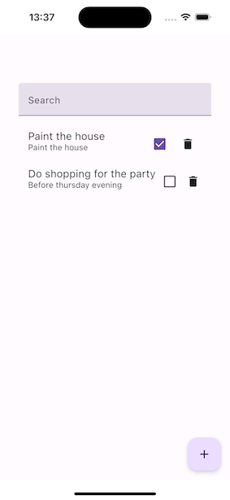
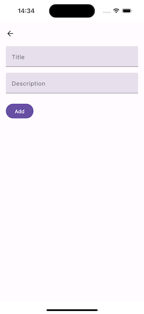
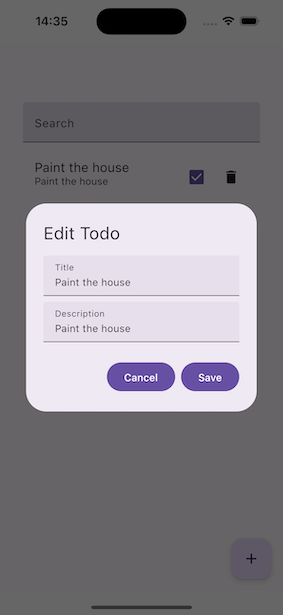

# Todo App

## Overview

The Todo App is a simple task management application built using Jetpack Compose for the UI and Kotlin for the backend logic. It allows users to add, edit, delete, and mark tasks as complete. The app is designed to help users keep track of their tasks efficiently.

## Features

- **Add Todo**: Users can add new tasks with a title and description.
- **Edit Todo**: Users can edit existing tasks.
- **Delete Todo**: Users can delete tasks they no longer need.
- **Mark as Complete**: Users can mark tasks as complete or incomplete.
- **Search**: Users can search for tasks by title or description.

## Screens

### Task List Screen

The main screen displays a list of tasks. Each task shows its title and description. Users can mark tasks as complete or delete them directly from this screen.



### Add Todo Screen

Users can navigate to the Add Todo screen to create a new task. They need to provide a title and description for the task.



### Edit Todo Dialog

When a task is clicked, an edit dialog appears, allowing users to update the task's title and description.



## Platform Support

The Todo App is supported on both Android and iOS platforms, providing a consistent experience across mobile devices.

## How to Use

1. **Clone the Repository**:
    ```sh
    git clone https://github.com/yourusername/todo-app.git
    cd todo-app
    ```

2. **Open the Project**:
    Open the project in your preferred IDE (e.g., Android Studio, IntelliJ IDEA, Visual Studio Code).

3. **Build the Project**:
    Use the following command to build the project:
    ```sh
    ./gradlew build
    ```

4. **Run the App**:
    Use the following command to run the app:
    ```sh
    ./gradlew run
    ```

5. **Add a Task**:
    - Click on the "Add" button (floating action button).
    - Enter the title and description of the task.
    - Click "Save" to add the task.

6. **Edit a Task**:
    - Click on a task in the list.
    - Update the title and/or description in the dialog.
    - Click "Save" to update the task.

7. **Delete a Task**:
    - Click the delete icon next to the task you want to delete.

8. **Mark a Task as Complete**:
    - Click the checkbox next to the task to mark it as complete or incomplete.

9. **Search for Tasks**:
    - Use the search bar at the top of the task list to filter tasks by title or description.

## Code Structure

- **Main UI Components**:
  - `TaskScreen.kt`: Contains the main task list screen.
  - `AddTodoView.kt`: Contains the UI for adding a new task.
  - `EditTodoDialog.kt`: Contains the UI for editing a task.

- **View Models**:
  - `TodoViewModel.kt`: Manages the state and business logic for tasks.

- **Data Models**:
  - `TodoItem.kt`: Represents a task with a title, description, and completion status.

- **Repositories**:
  - `TaskRepository.kt`: Handles data operations for tasks.

## Contributing

Contributions are welcome! Please open an issue or submit a pull request for any improvements or bug fixes.

## License

This project is licensed under the MIT License. See the [LICENSE](LICENSE) file for details.